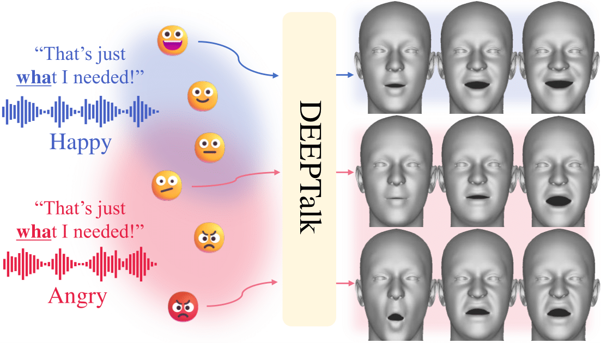

# DEEPTalk
Official code release of "[DEEPTalk: Dynamic Emotion Embedding for Probabilistic Speech-Driven 3D Face Animation](https://arxiv.org/abs/2408.06010)"

## Settings

## Evaluation

## Training

